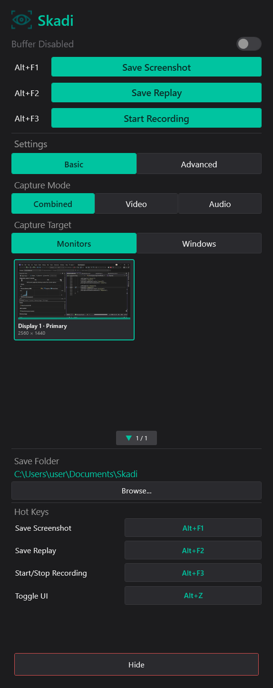
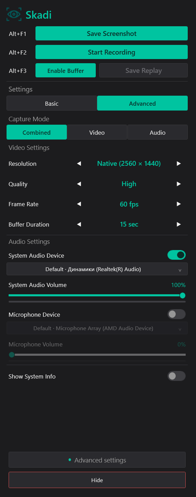

# Skadi

Skadi is a compact Windows desktop capture application with a WPF side-panel UI and a native GPU-accelerated recording pipeline.

It runs in the background and provides three primary workflows:

- screenshot capture with monitor or region selection;
- instant replay export from a rolling encoded buffer;
- continuous video, audio, or combined recording.

The recording and replay pipelines run in-process. Skadi does not bundle or launch FFmpeg.

## Download and Install

Download the current installer from the latest GitHub release:

```text
https://github.com/Catharsjs/Skadi/releases/latest/download/SkadiSetup.exe
```

The installer targets x64 Windows and installs the .NET 10 Desktop Runtime when it is missing.

## Requirements

- Windows 10 19041+ or Windows 11
- x64 system
- .NET 10 Desktop Runtime
- a Direct3D 11-compatible display adapter

## Default Hotkeys

| Action | Hotkey |
|---|---|
| Save Screenshot | `Alt+F1` |
| Start/Stop Recording | `Alt+F2` |
| Save Replay | `Alt+F3` |
| Show/Hide UI | `Alt+Z` |

Hotkeys can be changed or cleared in the UI.

## Features

### Screenshots

- Smooth multi-monitor selection overlay
- Full-monitor or region capture
- Windows 11 backend: Windows Graphics Capture (WGC)
- Windows 10 backend: Desktop Duplication API (DDA/DXGI)
- PNG output and clipboard copy
- Reusable GPU resources with explicit cleanup

### Video and Replay

- Monitor-only Capture Target selection
- Windows 11 capture backend: WGC
- Windows 10 capture backend: DDA/DXGI
- 30 or 60 FPS constant-frame-rate scheduling
- GPU BGRA-to-NV12 conversion
- Hardware H.264 encoding where supported
- Encoded replay ring buffer instead of raw-frame buffering
- Streaming fragmented MP4 writer for continuous recording
- In-process Media Foundation muxing and finalization
- Portrait and landscape monitor support

### Audio

- WASAPI loopback capture for system audio
- WASAPI microphone capture
- Per-source volume controls and live activity meters
- Shared 48 kHz stereo timeline for combined recording
- AAC audio in combined MP4 recordings
- Streaming MP3 writer in Audio mode
- In-process replay audio mixing and encoding

### Reliability

- Recording is rejected when available disk space is below 2 GiB
- Active recording is safely stopped when disk space crosses the 2 GiB threshold
- A 256 MiB finalize reserve is released before MP4 finalization
- Interrupted fragmented MP4 recordings are recovered on the next start
- Monitor topology changes safely stop an active recording
- Replay buffer is restarted after monitor topology changes
- Capture targets refresh with a fade transition
- Recording and disk-performance diagnostics are written to the application logs

### UI

- Background-first tray workflow
- Per-Monitor DPI Awareness V2
- Smooth show/hide and screenshot-selection transitions
- HUD modes: `None`, `Timer`, and `System Info`
- Capture Target changes are locked while recording

## Architecture

```text
EventCapture.App
  WPF UI, MVVM, settings, hotkeys, tray, notifications, HUD,
  capture orchestration and screenshot selection

EventCapture.Core
  audio capture and mixing, screenshot backends, replay export,
  streaming MP3, managed/native capture boundary

EventCapture.Native
  C++20 capture, GPU processing, H.264 encoding,
  encoded replay storage, fragmented MP4 writing and Media Foundation muxing
```

WGC and DDA are capture backends only. After a frame reaches the shared native pipeline, processing, pacing, encoding, replay storage, and file writing follow the same architecture.

### Video Recording Pipeline

```text
Selected monitor
    -> Windows 11: WGC / Windows 10: DDA-DXGI
    -> bounded latest-frame or monitor-frame queue
    -> constant 30/60 FPS scheduler
    -> Direct3D 11 scaling, rotation and BGRA-to-NV12 conversion
    -> H.264 encoder
    -> fragmented MP4 mux/writer
    -> Record YYYY-MM-DD HH-mm-ss.mp4
```

Frames are written continuously. A long recording is not accumulated as raw video in RAM.

### Combined Audio Pipeline

```text
WASAPI system audio + WASAPI microphone
    -> timestamp normalization and resampling
    -> shared 48 kHz stereo mixer and limiter
    -> native AAC input
    -> the same fragmented MP4 writer as video
```

### Replay Pipeline

```text
Encoded H.264 packets + segmented audio
    -> bounded time window
    -> snapshot requested by Save Replay
    -> in-process audio mix and Media Foundation mux
    -> Replay YYYY-MM-DD HH-mm-ss.mp4
```

The replay buffer stores encoded packets and short audio segments, not uncompressed video frames.

### Screenshot Pipeline

```text
Alt+F1
    -> freeze every connected monitor
    -> show selection overlays
    -> full-monitor or region selection
    -> PNG encoding
    -> save file and update clipboard
    -> release frozen bitmaps and reusable capture resources when appropriate
```

## Memory and Storage Behavior

- GPU textures and encoder surfaces are bounded pools.
- Replay video memory/storage is bounded by the configured replay duration.
- Continuous video is streamed directly into a fragmented MP4 file.
- Audio mode is streamed directly into MP3.
- Screenshot working memory may temporarily grow while monitor-sized bitmaps and PNG buffers exist; those objects are disposed after the operation.
- Windows and .NET may retain committed memory for reuse, so Task Manager working set does not always return immediately to its startup value.

Actual file size depends on resolution, FPS, quality/bitrate, encoder, scene complexity, and audio settings. WGC versus DDA does not inherently determine the final file size because both backends feed the same encoder configuration.

## Technology Stack

- C# and .NET 10
- WPF, XAML, and MVVM
- C++20 and C++/WinRT
- Windows Graphics Capture
- Desktop Duplication API / DXGI
- Direct3D 11
- Media Foundation H.264, AAC, MP3, and MP4 APIs
- Intel oneVPL/QSV compatibility runtime
- NAudio and WASAPI
- Inno Setup

## Build from Source

Development requirements:

- Visual Studio 2026
- .NET desktop development workload
- Desktop development with C++ workload
- Windows SDK 10.0.26100.0 or compatible
- MSVC toolset compatible with `v145`
- Inno Setup 6 for installer builds

Open `EventCapture.slnx` and build `Debug | x64` or `Release | x64`.

Command-line Release build:

```powershell
MSBuild EventCapture.slnx /t:Build /p:Configuration=Release /p:Platform=x64 /m
```

The app project copies `EventCapture.Native.dll` and the required oneVPL runtime into the application output directory.

## Build Installer

```powershell
MSBuild EventCapture.App\EventCapture.App.csproj /t:Restore,Publish /p:Configuration=Release /p:Platform=x64 /p:RuntimeIdentifier=win-x64 /p:SelfContained=false
ISCC Installer\Skadi.iss
```

Installer output:

```text
Installer/Output/SkadiSetup.exe
```

## Project Structure

```text
EventCapture.App/       WPF application and orchestration
EventCapture.Core/      managed capture, audio and storage services
EventCapture.Native/    native GPU video engine and C ABI
Installer/              Inno Setup installer
ThirdParty/oneVPL/      pinned oneVPL runtime, import library, headers and license
docs/screenshots/       README screenshots
```

## Known Platform Restrictions

- DRM-protected content may produce black frames or no capturable content.
- Elevated or secure-desktop windows are subject to Windows capture restrictions.
- Hardware encoder availability and performance depend on the active GPU and driver.
- Changing display topology intentionally finalizes the current recording rather than continuing with a stale frame.

## Screenshots




## License

Copyright (c) 2026 Catharsjs. All rights reserved.

This repository is public for portfolio and source-code review purposes only. See [LICENSE.md](LICENSE.md) for the complete terms.

Third-party components remain subject to their own licenses. The pinned oneVPL license is available at `ThirdParty/oneVPL/LICENSE.txt`.
